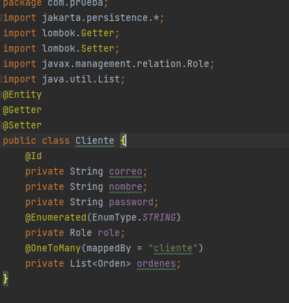
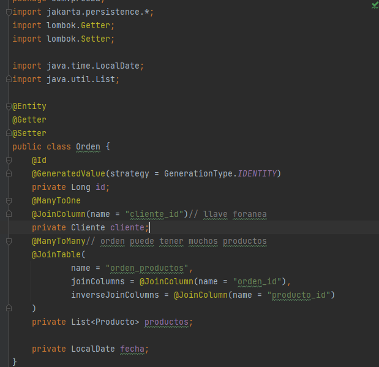

# prueba
## Creacion Spring Boot

## Creacion Base de Datos

# Documentación del Proyecto

## Clases del Proyecto

Este proyecto incluye varias clases que representan las entidades principales del sistema. A continuación se describen cada una de estas clases junto con los diagramas que ilustran sus relaciones.

@Entity indica que la clase Usuario representa una tabla en la base de datos.

@Id marca el atributo id como la clave primaria. Esto significa que cada usuario tendrá un identificador único.

### 1. **Empresa**

**Descripción**: Cada empresa está identificada de manera única por su número de identificación tributaria (`NIT`). La clase también almacena información básica como el nombre, dirección y teléfono de la empresa.

### 2. **Producto**

**Descripción**: La clase **Producto** representa un producto disponible en el sistema. Cada producto tiene un código único generado automáticamente. Además de un nombre y características, esta clase mantiene una lista de precios asociados, una relación con una empresa y una lista de categorías a las que pertenece el producto.

### 3. **Precio**

**Descripción**: La clase **Precio** representa el precio de un producto en una moneda específica. Cada precio tiene un identificador único y está asociado a un producto. Esta clase almacena el valor del precio y la moneda en la que está establecido.

### 4. **Categoria**

**Descripción**: La clase **Categoria** representa una categoría a la que se pueden asignar productos. Cada categoría tiene un identificador único y un nombre. Esta clase también mantiene una lista de productos que pertenecen a la categoría.

### 5. **Cliente**

**Descripción**: La clase **Cliente** representa a un cliente en el sistema. Cada cliente está identificado por un correo electrónico único. Además del nombre y la contraseña encriptada, esta clase incluye un rol que puede ser `ADMIN` o `EXTERNO`, y mantiene una lista de órdenes realizadas por el cliente.

### 6. **Role**

**Descripción**: La clase **Role** es un enumerado que define los roles disponibles para un cliente en el sistema. Los roles posibles son `ADMIN` y `EXTERNO`, que determinan los permisos y accesos del cliente dentro de la aplicación.

### 7. **Orden**

**Descripción**: La clase **Orden** representa una orden realizada por un cliente. Cada orden tiene un identificador único (`id`), una relación con el cliente que realizó la orden, y una lista de productos asociados a la orden. También almacena la fecha en que se realizó la orden.

## Front

## Estructura final
